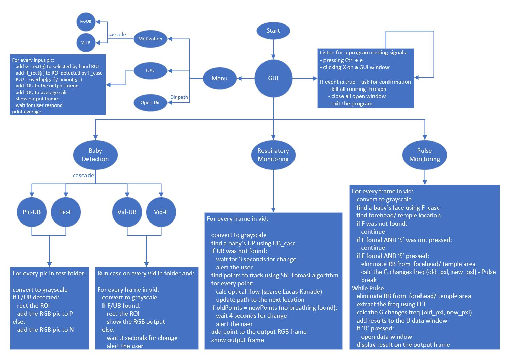
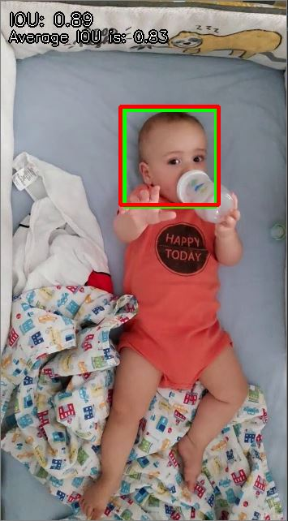
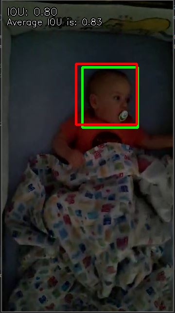

# BDC - Breathing_Detection_Camera

In this project I will research and explore the field of infants motion monitoring using a simple camera.  
The Three key features are:
 - baby (only) detection
 - baby respiratory monitoring
 - baby pulse monitoring

All three works at real time. 
All three are using a costume made cascade classifier in order to detect babys in  bed.

 

## Baby Face Realtime Detection:

 

## Intersection over Union (IOU) Results:
    | 
 
 
  
# Resources used

## Viola-Jones: Haar features, Cascade Classifier Training
https://sites.google.com/site/5kk73gpu2012/assignment/viola-jones-face-detection#TOC-Cascade-Classifier  
https://www.mathworks.com/help/vision/ug/train-a-cascade-object-detector.html  
https://www.hindawi.com/journals/mse/2015/948960/ - Haar and LBP  
https://sites.google.com/site/5kk73gpu2012/assignment/viola-jones-face-detection#TOC-Image-Pyramid  
http://amin-ahmadi.com/cascade-trainer-gui/  
https://docs.opencv.org/2.4/modules/objdetect/doc/cascade_classification.html  
https://github.com/opencv/opencv/tree/master/data/haarcascades - all openCV classifiers  

## Respiratory Monitoring: Optical flow (Lucas-Kanade, Gunnar-Farneback), Corner detection (Shi-Tomasi, Harris-Stephens)
https://opencv-python-tutroals.readthedocs.io/en/latest/py_tutorials/py_video/py_lucas_kanade/py_lucas_kanade.html  
https://www.youtube.com/watch?v=a-v5_8VGV0A&t=4128s&ab_channel=JosephRedmon  
https://docs.opencv.org/2.4/modules/video/doc/motion_analysis_and_object_tracking.html  
https://www.diva-portal.org/smash/get/diva2:273847/FULLTEXT01.pdf  
https://nanonets.com/blog/optical-flow/  
https://aishack.in/tutorials/harris-corner-detector/  
https://aishack.in/tutorials/shitomasi-corner-detector/  
https://opencv-python-tutroals.readthedocs.io/en/latest/py_tutorials/py_feature2d/py_shi_tomasi/py_shi_tomasi.html  
https://arxiv.org/pdf/1909.03503.pdf - monitoring breathing rate from face alone -> future todo  

## Pulse Monitoring:
https://github.com/thearn/webcam-pulse-detector  
https://ep.liu.se/ecp/129/002/ecp16129002.pdf  
https://academic.oup.com/cardiovascres/article/70/1/12/408540 - Mayer waves and nerves frequencies   
https://en.wikipedia.org/wiki/Mayer_waves  

## Eulerian Magnification
http://people.csail.mit.edu/mrub/evm/#code - MIT  
https://www.microsoft.com/en-us/research/wp-content/uploads/2013/01/bill-freeman_visualmotion.pdf - Microsoft  
https://github.com/brycedrennan/eulerian-magnification  
